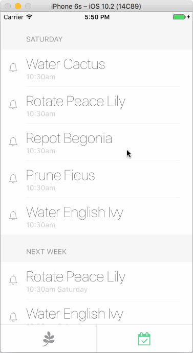
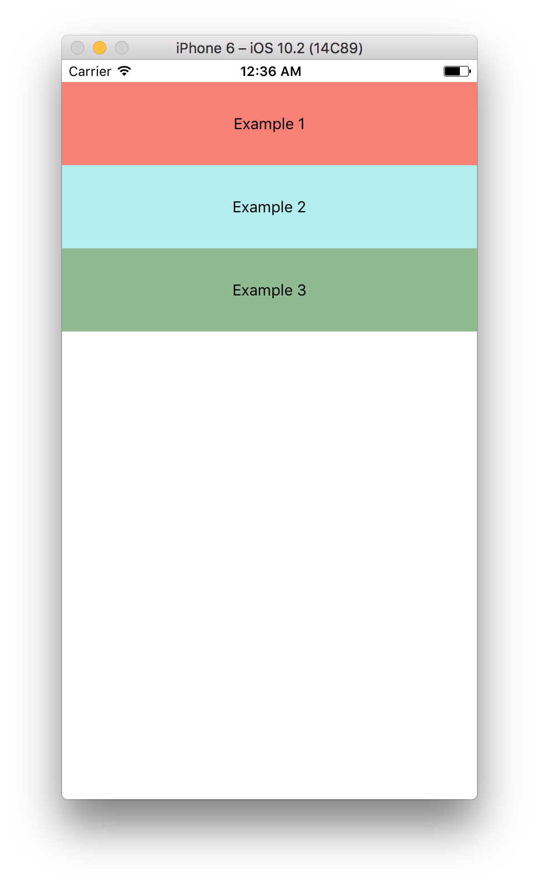

# React Native Swipeable [![NPM version][npm-image]][npm-url]

React Native swipe component.



## Installation

```sh
npm i --save react-native-swipeable
```

## Usage

Wrap your ListView/TableView items with the `Swipeable` component:

```javascript
import Swipeable from 'react-native-swipeable';

const leftContent = <Text>Pull to activate</Text>;

const rightButtons = [
  <TouchableHighlight>
    <Text>Button 1</Text>
  </TouchableHighlight>,
  <TouchableHighlight>
    <Text>Button 2</Text>
  </TouchableHighlight>
];

function MyListItem() {
  return (
    <Swipeable leftContent={leftContent} rightButtons={rightButtons}>
      <Text>My swipeable content</Text>
    </Swipeable>
  );
}
```

### Props

| prop                            | type         | default | description                                                                               |
|---------------------------------|--------------|---------|-------------------------------------------------------------------------------------------|
| `children`                      | renderable   | `null`  | (optional) swipeable content                                                              |
| `leftContent`                   | renderable   | `null`  | (optional) left content visible during pull action                                        |
| `rightContent`                  | renderable   | `null`  | (optional) right content visible during pull action                                       |
| `leftButtons`                   | renderable[] | `null`  | (optional) array of buttons, first being the innermost; ignored if `leftContent` present  |
| `rightButtons`                  | renderable[] | `null`  | (optional) array of buttons, first being the innermost; ignored if `rightContent` present |
| `leftActionActivationDistance`  | integer      | 125     | (optional) minimum swipe distance to activate left action                                 |
| `onLeftActionRelease`           | function     | `null`  | (optional) user has swiped beyond `leftActionActivationDistance` and released             |
| `rightActionActivationDistance` | integer      | 125     | (optional) minimum swipe distance to activate right action                                |
| `onRightActionRelease`          | function     | `null`  | (optional) user has swiped beyond `leftActionActivationDistance` and released             |
| `leftButtonWidth`               | integer      | 75      | (optional) resting visible peek of each left button after buttons are swiped open         |
| `rightButtonWidth`              | integer      | 75      | (optional) resting visible peek of each right button after buttons are swiped open        |
| `onRef`                         | function     | `null`  | (optional) receive swipeable component instance reference                                 |
| `onPanAnimatedValueRef`         | function     | `null`  | (optional) receive swipeable pan `Animated.ValueXY` reference for upstream animations     |

### Advanced Props

[Check out the `Swipeable` component's `propTypes`](https://github.com/jshanson7/react-native-swipeable/blob/master/src/index.js#L14) for a huge list of options including animation lifecycle hooks and low-level overrides.

### Instance Methods

#### recenter()

Imperatively reset swipeable component back to initial position.  This is useful if buttons are exposed and the user has begun scrolling the parent view.

```javascript
class MyListItem extends Component {

  swipeable = null;

  handleUserBeganScrollingParentView() {
    this.swipeable.recenter();
  }

  render() {
    return (
      <Swipeable onRef={ref => this.swipeable = ref} rightButtons={rightButtons}>
        <Text>My swipeable content</Text>
      </Swipeable>
    );
  }
}
```

## Example

To run [the example](https://github.com/jshanson7/react-native-swipeable/blob/master/example/swipeable-example.js):

```sh
cd example
npm install
react-native run-ios
```



## License

MIT

[npm-image]: https://badge.fury.io/js/react-native-swipeable.svg
[npm-url]: https://npmjs.org/package/react-native-swipeable
